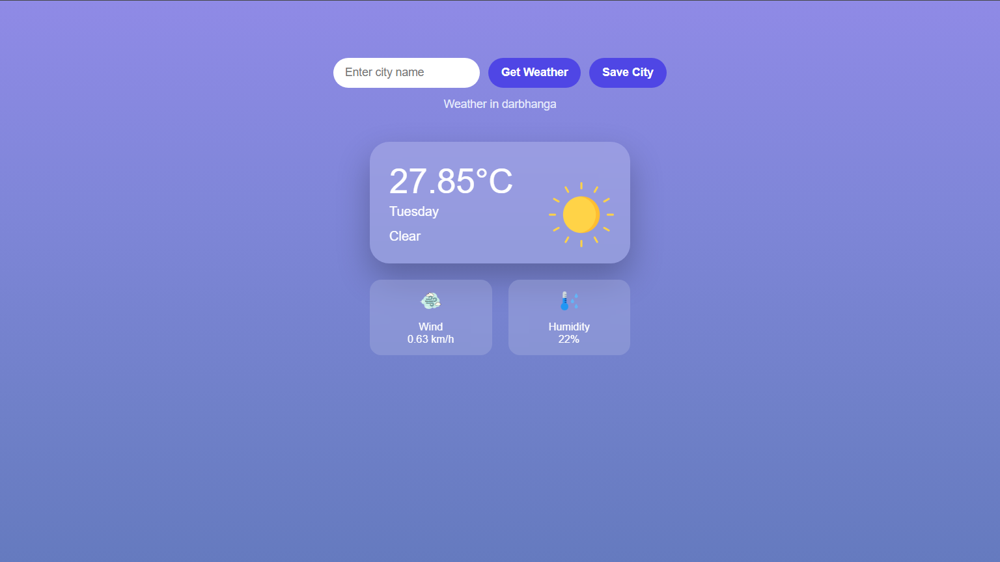

# 🌦️ Weather App

A simple and responsive weather application that provides real-time weather information for any city worldwide.  
Built to deliver accurate data with a clean and user-friendly interface.

---

## 🚀 Live Demo

🔗 [View Live Project](https://satyam-2x.github.io/weather-app/)

---

## 📸 Preview



---

## ✨ Features

- Search weather by city name  
- Real-time temperature display  
- Humidity and wind speed details  
- Dynamic weather icons  
- Responsive design for all devices  

---

## 🛠️ Tech Stack

- HTML5  
- CSS3  
- JavaScript  
- Weather API (e.g., OpenWeather API)  
- Git & GitHub  

---

## ⚙️ How It Works

The application fetches real-time weather data from a public API and dynamically updates the UI based on the searched location.

---

## 📦 Installation

1. Clone the repository  
   ```bash
   git clone https://github.com/satyam-2x/weather-app.git